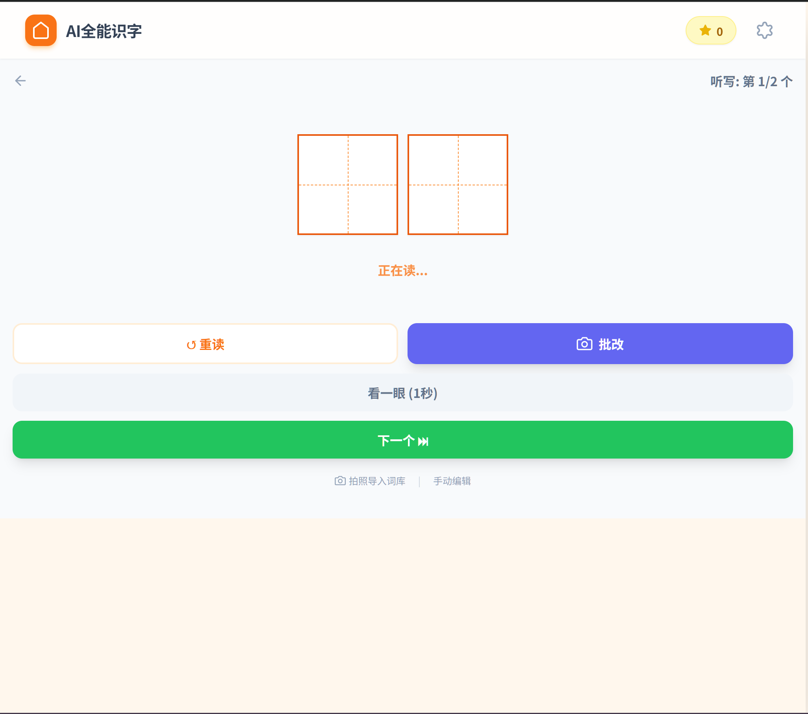

# AI Hanzi Tutor (AI全能识字助手)

这是一个基于 AI LLM 的全能儿童识字与听写助手。专为学龄前及低年级儿童设计，通过趣味互动、AI 讲解、语音识别等技术，让孩子快乐地学习汉字。

## 📸 界面预览

<div align="center">
  
  
</div>
<div align="center">
  
  
</div>

## ✨ 核心功能

### 🎴 识字卡片模式 (Literacy Cards)
- **田字格展示**：标准的田字格汉字展示，帮助孩子掌握结构。
- **笔顺动画**：使用 `Hanzi Writer` 展示汉字笔画顺序，支持“写一写”描红练习。
- **AI 趣味讲解**：
  - **智能解释**：AI 扮演语文老师，用适合 5 岁孩子的语言解释字义和组词。
  - **易混字辨析**：AI 自动找出形近字或音近字，教孩子如何区分。
  - **创意绘本**：利用当前学习的生字，AI 即时生成有趣的短篇童话故事。
  - **角色扮演聊天**：孩子可以和“汉字”对话，AI 会扮演该汉字与孩子互动。
- **拍照加字**：拍书本或卡片，AI 自动识别其中的汉字并加入生字本。
- **真人/AI 发音**：支持多种语音引擎（Siri、Google、Ting-Ting 等）朗读发音。

### 📝 听写练习模式 (Dictation Practice)
- **自动报词**：自动朗读词语，支持循环播放（读 3 遍）。
- **语音控制**：无需动手，喊出“下一个”、“重读”、“看一眼”即可控制流程（需浏览器支持）。
- **智能批改**：听写完成后，拍照上传，AI 老师帮忙检查对错并给出点评。
- **防作弊模式**：平时隐藏文字，支持“看一眼”功能（限时 1 秒或 3 秒）。
- **拍照导入词库**：拍课本生字表，一键导入听写列表。

## 🛠️ 技术栈

本项目使用 Vite + React 构建，适合部署到 Cloudflare Pages 等静态托管平台。

- **核心框架**: React + ReactDOM
- **构建工具**: Vite
- **UI 样式**: Tailwind CSS
- **汉字笔顺**: Hanzi Writer
- **AI 模型**: Google Gemini API 或 OpenAI 兼容接口 (支持自定义 API 地址和模型)
- **语音技术**: Web Speech API (SpeechSynthesis & webkitSpeechRecognition) + ResponsiveVoice
- **本地存储**: LocalStorage (保存学习进度、设置和词库)

## 🚀 如何使用

### 1. 获取代码
直接克隆本仓库或下载 ZIP 包。

```bash
git clone https://github.com/zhumao520/AI-Hanzi-Tutor.git
```

### 2. 安装依赖

```bash
npm install
```

### 3. 本地开发

```bash
npm run dev
```
然后访问终端输出的本地地址。

### 4. 生产构建

```bash
npm run build
```

构建产物会输出到 `dist/`。

### 5. 配置 AI
首次打开时，点击右上角的 **设置 (⚙️)** 图标：
1. 选择 **Gemini** 或 **OpenAI 兼容接口**。
2. 输入对应的 **API Key**。Gemini Key 可在 [Google AI Studio](https://aistudio.google.com/) 免费申请。
3. 如果选择 OpenAI 兼容接口，填写 API 地址，例如 `https://api.openai.com/v1/chat/completions`。
4. 选择或填写 AI 模型。
5. (可选) 选择喜欢的朗读语音。

## ☁️ Cloudflare Pages

Cloudflare Pages 推荐配置：

```text
Framework preset: None 或 Vite
Build command: npm run build
Build output directory: dist
Root directory: /
```

当前源码不需要手动嵌入 Cloudflare Web Analytics 脚本；如需统计，请在 Cloudflare 控制台开启 Web Analytics 或 Pages Analytics。

## ⚠️ 浏览器兼容性

- **推荐浏览器**: Chrome (桌面版/Android) 或 Edge。
- **iOS Safari**: 支持大部分功能，但“语音控制”功能可能受限于 iOS 策略（需点击屏幕唤醒）。
- **语音识别**: 依赖 `webkitSpeechRecognition` API，目前在 Chrome 内核浏览器上体验最佳。

## 📱 移动端适配
本项目完美适配移动端（手机/平板），支持“屏幕常亮”功能，防止学习过程中自动锁屏。

## 📄 许可证
MIT License
